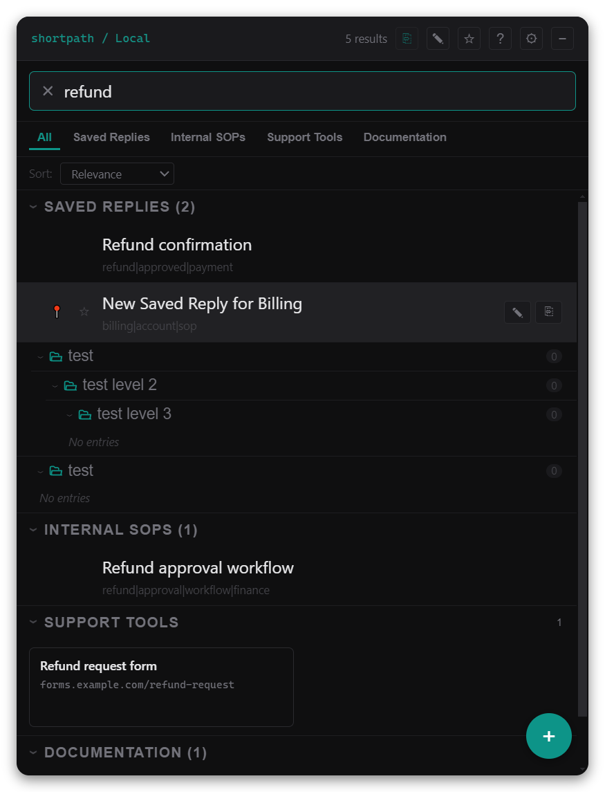
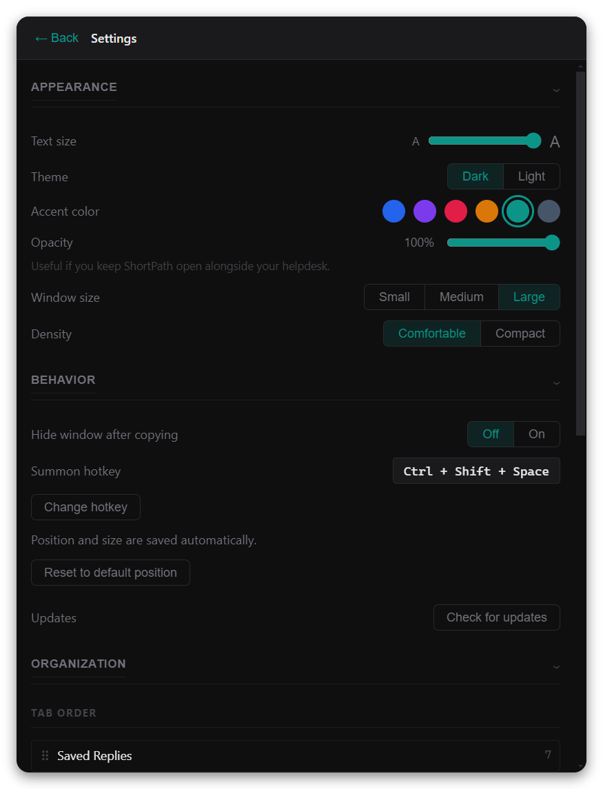
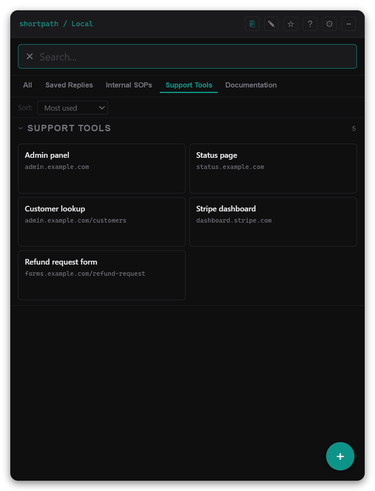

# ShortPath

A local-first documentation, saved-reply, and process hub for support agents.

Download it to your machine. Import your team's resources via CSV. Search across everything at once. Copy with one click. Nothing leaves your machine.

---

## What it does

- **Universal search** — one search bar across every category at once: Saved Replies, Documentation, SOPs, Support Tools, and any custom categories you define. Results group by category with hit counts, each group expandable.
- **Copy in one click** — every result has a direct copy button. Keyboard-first: arrow keys to move, Enter to copy, Esc to dismiss.
- **Sub-folders** — organise entries within a vertical into named sub-folders. Manage them in Settings; assign them when adding or editing an entry.
- **Support Tools grid** — quick-launch links open in your default browser. Reorder, add, and edit tools without leaving the app.
- **Team sync** — point ShortPath at a shared CSV on a network drive, Dropbox, or OneDrive folder. It watches the file and reloads automatically. Your local entries are never touched by sync.
- **CSV import / export** — import entries in bulk; export your personal entries to hand off to an admin, or export everything for backup.
- **Notes** — a lightweight scratchpad inside the app. Notes can be linked to a specific entry for context.
- **Favorites** — star entries for instant access from the favorites view.
- **Clipboard capture** — if text is on the clipboard when you open the app, a banner offers to save it as a new entry with one click.
- **Paste-and-split** — paste a multi-section document; ShortPath splits it into entries on headings.
- **In-overlay editing** — open any entry to read it in full. Local entries are editable in-place; synced entries can be duplicated to local.
- **Settings** — configurable global hotkey, adjustable text size, light/dark theme, window position reset, and vertical/sub-folder management.
- **Help system** — 16 searchable in-app help topics covering every feature. No browser required.
- **System tray** — lives in the tray. Summon with a global hotkey (default: Ctrl/Cmd+Shift+Space). Opens as a popup at the bottom-left corner; size and position persist.

---

## Installation

Download the latest installer from the [Releases page](https://github.com/Dadpops/ShortPath/releases).

| Platform | File | Notes |
|---|---|---|
| Windows | `ShortPath-Setup-x.y.z.exe` | NSIS installer. SmartScreen will warn on first run — click "More info → Run anyway". See [docs/INSTALLING.md](docs/INSTALLING.md). |
| macOS | `ShortPath-x.y.z.dmg` | Not notarised. Gatekeeper will block unsigned builds. See [docs/INSTALLING.md](docs/INSTALLING.md). |

Your data lives in the OS app-data folder (`%APPDATA%\ShortPath` on Windows, `~/Library/Application Support/ShortPath` on macOS) and is not affected by reinstalling or updating.

---

## Screenshots

| Search results | Settings | Support Tools |
|:---:|:---:|:---:|
|  |  |  |

---

## Status

v0.2.0 — all planned phases complete. Recent additions include nested sub-folders, delete vertical, in-app update notifications, accent colors, opacity/size presets, density toggle, pinned entries, sort control, and usage tracking.

See [docs/ROADMAP.md](docs/ROADMAP.md) for the full phase checklist and [CHANGELOG.md](CHANGELOG.md) for what changed in each release.

---

## Tech stack

| Layer | Technology |
|---|---|
| Desktop shell | Electron |
| UI | React + Vite (TypeScript) |
| Storage | Local JSON file (no database) |
| Search | Fuse.js — in-renderer, title-weighted, fuzzy threshold |
| CSV | PapaParse — import, export, lossless round-trip |
| Packaging | electron-builder (NSIS for Windows, DMG for Mac) |

No backend. No AI. No accounts. No network calls.

---

## Development

```bash
npm install
npm run dev        # Vite renderer dev server + Electron main watcher
```

Electron will launch automatically once both processes are ready.

## Build

```bash
npm run build          # compile renderer + main
npm run dist:win       # NSIS installer for Windows
npm run dist:mac       # DMG for Mac
```

## Project conventions

See [CLAUDE.md](CLAUDE.md) for coding conventions, commit style, and session workflow.

---

## License

ShortPath is open source under the [MIT License](LICENSE).
