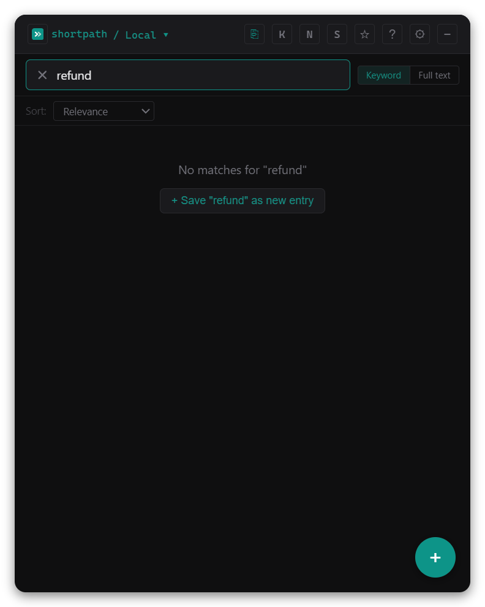
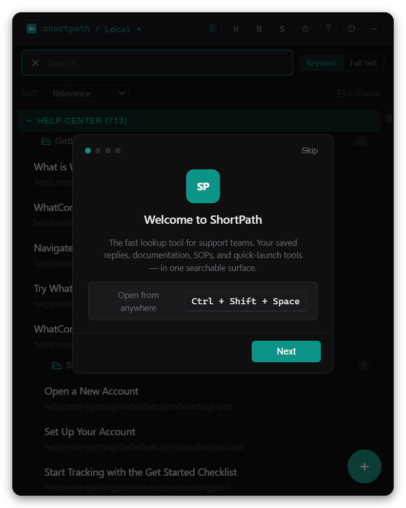
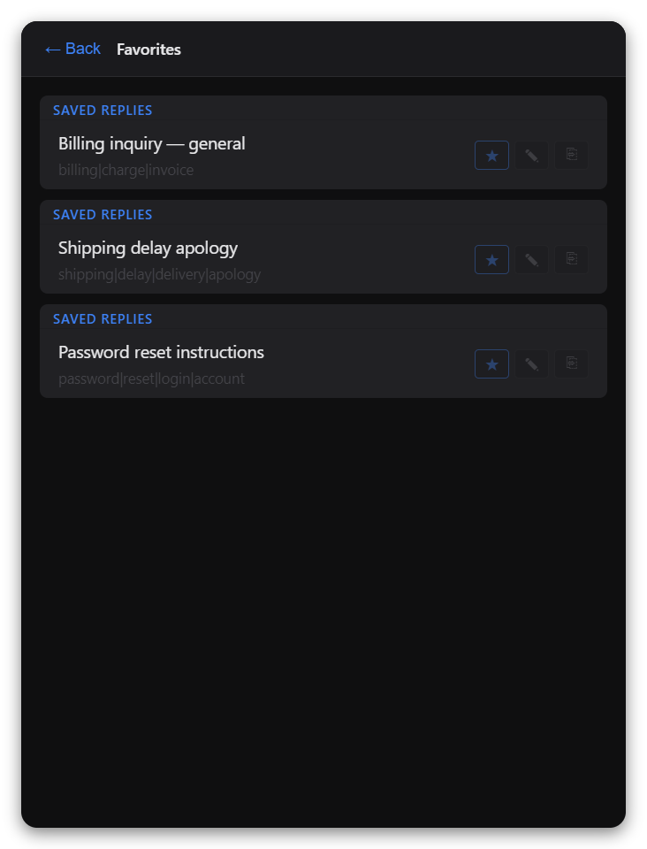
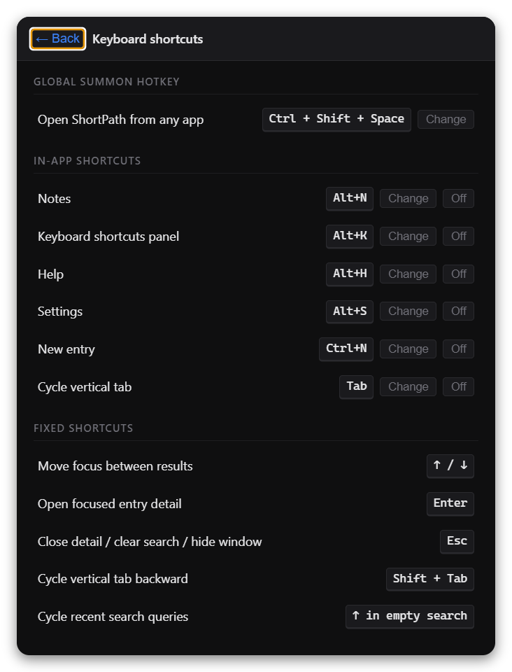
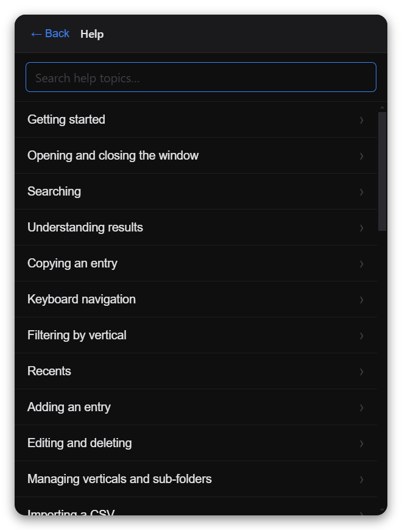

# ShortPath

**The support knowledge hub that lives on your desktop, not in another browser tab.**

Press a hotkey. Type a word. Copy your reply. Back to the ticket in under five seconds.

[](https://github.com/Dadpops/ShortPath/releases)
[](LICENSE)
[](https://github.com/Dadpops/ShortPath/releases)

<p align="center">
  
</p>

---

## The problem it solves

Support agents waste time switching between tabs, hunting through docs, and retyping the same responses. ShortPath puts your entire knowledge library (saved replies, SOPs, documentation, quick links) in a single searchable popup that appears instantly from any app.

No login. No browser. Nothing sent to a server. Everything runs on your machine.

---

## What makes it different

### One search, every category



Type a word and see hits across Saved Replies, Documentation, SOPs, and any custom categories you have created. All at once, grouped by category, instantly filtered as you type.

The search is fuzzy and title-weighted. Switch between **Keyword** mode (titles and tags only) and **Full text** mode (searches body content too) with a single toggle next to the search bar.

<br clear="right" />

### Up and running in minutes



A 4-step onboarding overlay walks you through the app on first launch. Load 50 sample entries in one click to explore every feature before importing your own data. The overlay is skippable and replayable any time from Settings.

<br clear="right" />

### Always there, never in the way

Press `Ctrl+Shift+Space` (or your custom hotkey) from anywhere on your desktop. ShortPath appears at the bottom-left corner. Press it again and it hides.

**Compact mode** shrinks the window to a 64x64 icon that floats wherever you drag it. Press `Ctrl+Shift+.` (or your compact hotkey) to toggle it from any app. The icon remembers its last position and always uses your accent color.


<br clear="right" />

### Rich text that pastes right

Format replies with bold, bullet lists, headers, and code blocks. Choose per-entry whether copying gives you formatted HTML (for Gmail, Zendesk, Intercom) or clean plain text (for tickets with plain-text fields).

### Support Tools grid


Quick-launch links for your admin panel, billing tool, status page, and more, in a 2-column card layout at the bottom of the browse view. Pin, star, reorder, and open them directly without leaving ShortPath.

<br clear="right" />

### Favorites



Star any entry to add it to your Favorites view for instant access. Entries show their vertical label so you always know where they came from.

<br clear="right" />

### Team sync without a backend

Connect one or more CSV files from shared cloud folders (Google Drive, Dropbox, OneDrive, network drives). Each source can have a friendly name. Switch between Local, a specific source, or All at once from the header. In All mode, results are grouped by source and category. Your personal entries are never touched by sync.

### Capture from anywhere

Import entries from a URL (paste any web page URL and edit the extracted text), drag in a Markdown or PDF file, or use the Chrome/Firefox browser extension to send the current page directly to ShortPath.

### Make it yours


6 accent color presets, dark/light theme, opacity slider, compact/comfortable density, window size, and font family. The compact mode icon and toggle button both reflect your chosen accent color.

<br clear="right" />

### Keyboard shortcuts



Every action has a shortcut. The global summon hotkey and the compact mode toggle hotkey are both fully remappable. In-app shortcuts (Notes, Help, add an entry, cycle categories) can each be changed or turned off independently.

<br clear="right" />

### In-app help



30+ help topics covering every feature, searchable and always one keypress away. The help window matches your chosen theme and accent color.

<br clear="right" />

### Organized the way support teams think

Verticals (categories) -> sub-folders -> entries. Nest as deep as you need. Filter by category with tab buttons or a dropdown. Drag to reorder. Add new categories on the fly.

---

## Screenshots

<table>
  <tr>
    <td align="center">
      
      <br />
      <strong>Browse view</strong>
      <br />
      <sub>All your entries grouped by category, ready to search.</sub>
    </td>
    <td align="center">
      
      <br />
      <strong>Search in action</strong>
      <br />
      <sub>One query returns hits across every category at once.</sub>
    </td>
    <td align="center">
      
      <br />
      <strong>First-run onboarding</strong>
      <br />
      <sub>4-step walkthrough with sample data to explore immediately.</sub>
    </td>
    <td align="center">
      
      <br />
      <strong>Settings</strong>
      <br />
      <sub>Theme, accent, hotkey, opacity, window size in one panel.</sub>
    </td>
  </tr>
  <tr>
    <td align="center">
      
      <br />
      <strong>Keyboard shortcuts</strong>
      <br />
      <sub>Summon hotkey, compact hotkey, and every in-app shortcut, all remappable.</sub>
    </td>
    <td align="center">
      
      <br />
      <strong>In-app help</strong>
      <br />
      <sub>30+ searchable topics. Respects your theme and accent color.</sub>
    </td>
    <td align="center">
      
      <br />
      <strong>Support Tools</strong>
      <br />
      <sub>Quick-launch links in a 2-column card layout.</sub>
    </td>
    <td align="center">
      
      <br />
      <strong>Favorites</strong>
      <br />
      <sub>Starred entries from any category, all in one place.</sub>
    </td>
  </tr>
</table>

---

## Feature list

| Feature | Details |
|---|---|
| Global hotkey | Summon / dismiss from anywhere. Default: Ctrl/Cmd+Shift+Space. Fully configurable. |
| Compact mode | Shrinks to a 64x64 accent-colored icon. Toggle with Ctrl/Cmd+Shift+. (remappable). Remembers drag position. |
| Full-text search | Fuse.js, title-weighted, fuzzy. Keyword or Full text mode. Searches all active sources and categories at once. |
| Rich text editor | Bold, italic, underline, lists, code, hyperlinks. Copy as plain text or HTML per entry. |
| Source selector | Switch between Local, a named sync source, or All from the header. In All mode results group by source then category. |
| Multi-source sync | Connect multiple CSV files (cloud or local). Each source has a friendly name and can be refreshed or disconnected independently. |
| URL import | Paste a URL, extract the page text, edit it inline, then save as an entry. |
| File drag-in | Drag a Markdown (.md) or PDF file onto the app to import its text as an entry. |
| Browser extension | Chrome and Firefox extension sends the current page to ShortPath with one click. Queue of up to 20 captured pages. |
| CSV import | Drag-drop or browse. Column mapping for any CSV format. Duplicate detection with per-row resolution. |
| CSV export | All entries, or a filtered selection via checkbox tree. |
| Always-on-top | Keep the window above other apps via Settings > Behavior. Compact mode respects this setting. |
| Pinned entries | Up to 8 entries pinned to the top of the browse view. Collapsible. |
| Favorites | Star entries for quick access from the dedicated Favorites view. |
| Notes | Private scratchpad entries, linked to any resource. Auto-saves. |
| Support Tools grid | Quick-launch links open in the browser. 2-column grid, reorderable, pinneable and favoritable. |
| Nested sub-folders | Organize entries within any vertical. Unlimited depth. |
| Clipboard capture | Clipboard text detected on focus. One click to save it as a new entry. |
| Paste and split | Paste a multi-section document; ShortPath splits it into separate entries on headings. |
| Tab / filter bar | Filter visible results to one category. Tabs for up to 5 categories, dropdown beyond that. |
| Sort modes | Relevance, most used, recently added, A to Z. |
| Usage tracking | Copy count badge on each row. Used to rank "most used" sort. |
| Accent color + theme | 6 preset accent colors, dark/light theme, opacity slider, compact/comfortable density. Compact icon matches accent. |
| Keyboard navigation | Arrow keys to move, Enter to open, Esc to dismiss. Tab to cycle category filter. |
| Overflow header menu | When window is narrow, toolbar collapses to a ... menu. Minimum window size enforced. |
| In-app help | 30+ searchable topics covering every feature. Matches your theme and accent color. |
| First-run onboarding | 4-step walkthrough on first launch. Replayable from Settings. |
| Sample data | 50 sample entries pre-loaded to explore the app. Removable in one click. |
| Auto-update | App checks for new releases and installs them with one click. |
| Crash recovery | If the renderer crashes, the app reloads automatically instead of disappearing. |

---

## Install

Download the latest installer from the **[Releases page](https://github.com/Dadpops/ShortPath/releases)**.

| Platform | File | Notes |
|---|---|---|
| Windows | `ShortPath Setup 0.6.8.exe` | SmartScreen warning on first run. Click "More info -> Run anyway". |
| macOS | `ShortPath-x.y.z.dmg` | Gatekeeper will block unsigned builds. See [docs/INSTALLING.md](docs/INSTALLING.md). |

Your data lives in `%APPDATA%\ShortPath` (Windows) or `~/Library/Application Support/ShortPath` (macOS). Reinstalling or updating does not affect your entries.

---

## For teams

1. Create a CSV with your team's saved replies, SOPs, and documentation links. Download the template from Settings > Data.
2. Put the file in a shared folder (Dropbox, Google Drive, OneDrive, network drive).
3. Each agent installs ShortPath, opens Settings > Sync, clicks "Add sync source," and selects the CSV.
4. Give the source a friendly name (e.g. "Team Replies"). ShortPath watches it for changes automatically.
5. When you update the CSV, agents get the new entries on next sync. Their personal entries are never affected.

The admin owns the shared file. Agents own their local entries. ShortPath never writes back to the shared file.

Multiple sources are supported. Connect a team CSV, a personal reference CSV, and a product docs CSV all at once.

---

## Browser extension

The extension is in `extensions/` -- one folder for Chrome/Edge, one for Firefox.

**Chrome/Edge:** Go to `chrome://extensions`, enable Developer Mode, click "Load unpacked," select `extensions/chrome`.

**Firefox:** Go to `about:debugging`, click "This Firefox," load `extensions/firefox/manifest.json`.

Click the extension icon on any page to send it to ShortPath. A queue badge shows how many pages are waiting. ShortPath opens automatically to the import form.

---

## Contributing

```bash
git clone https://github.com/Dadpops/ShortPath.git
cd ShortPath
npm install
npm run build   # compile renderer + main
npm run electron  # launch the app
```

For hot-reload development, open two terminals:
```bash
# Terminal 1
npm run dev

# Terminal 2 (after "Found 0 errors" appears)
npm run electron
```

Feature branches off `master`, PRs to `master`.

See [CLAUDE.md](CLAUDE.md) for coding conventions, commit style, and session workflow.

---

## License

MIT -- free for personal and commercial use.
